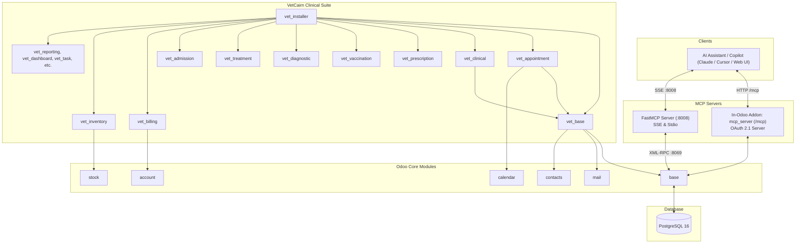

# Dependency Map

```mermaid
graph TD
    subgraph Clients
        AI["AI Assistant / Copilot (Claude / Cursor / Web UI)"]
    end

    subgraph MCP Servers
        InAppMCP["In-Odoo Addon: mcp_server (/mcp)<br/>OAuth 2.1 Server"]
        FastMCP["FastMCP Server (:8008)<br/>SSE & Stdio"]
    end

    subgraph Odoo Core Modules
        Base["base"]
        Mail["mail"]
        Contacts["contacts"]
        Account["account"]
        Stock["stock"]
        Calendar["calendar"]
    end

    subgraph VetCairn Clinical Suite
        VetInstaller["vet_installer"]
        VetBase["vet_base"]
        VetAppt["vet_appointment"]
        VetClinical["vet_clinical"]
        VetRx["vet_prescription"]
        VetVax["vet_vaccination"]
        VetDiag["vet_diagnostic"]
        VetTreat["vet_treatment"]
        VetAdm["vet_admission"]
        VetBill["vet_billing"]
        VetInv["vet_inventory"]
        VetOther["vet_reporting, vet_dashboard, vet_task, etc."]
    end

    subgraph Database
        Postgres[("PostgreSQL 16")]
    end

    AI <-->|HTTP /mcp| InAppMCP
    AI <-->|SSE :8008| FastMCP
    FastMCP <-->|XML-RPC :8069| Base
    InAppMCP <--> Base

    VetInstaller --> VetBase
    VetInstaller --> VetAppt
    VetInstaller --> VetClinical
    VetInstaller --> VetRx
    VetInstaller --> VetVax
    VetInstaller --> VetDiag
    VetInstaller --> VetTreat
    VetInstaller --> VetAdm
    VetInstaller --> VetBill
    VetInstaller --> VetInv
    VetInstaller --> VetOther

    VetBase --> Base
    VetBase --> Mail
    VetBase --> Contacts

    VetClinical --> VetBase
    VetAppt --> VetBase
    VetAppt --> Calendar
    VetBill --> Account
    VetInv --> Stock

    Base <--> Postgres
```
